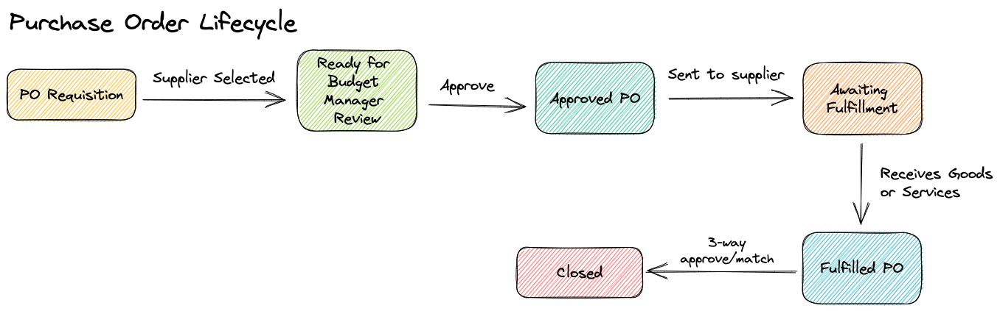

# Domain Modeling Workshop

> A model is a simplification. It is an interpretation of reality that abstracts the aspects relevant to solving the problem at hand and ignores extraneous detail.
>
> Eric Evans, Domain Driven Design

When developers are working on a software system they learn about the business and industry that the software is for. If you're working in finance you're going to learn about how transactions and accounts work, and you'll learn the specific rules for calculating interest in different kinds of financial instruments. If you're working in shipping you'll learn about how cargo makes its way to ports, is loaded onto ships and is moved around the globe satisfying complex and dynamic requirements about tracking and arrival dates. We learn all this domain knowledge and then encode it into the software systems that we build.

Well-designed systems **model** the business domain. The developers encode the knowledge about the domain into the system. This has two main benefits.

The first is that your software systems are intention revealing. They emanate domain knowledge. If a new developer is reading a section of code they learn about the domain by learning about the software system. You don't even need to be a new developer on the project -- it can just be you six months after you wrote something.

The second is that systems become easier to change. Software systems are designed well when, among other things, they are easy to change. Systems that model their domain effectively will be easier to understand, and therefore easier to change. If a system models the domain well then new features requests will naturally fit into the system more smoothly with less work and awkwardness.

## Introducing the Workshop

Unless you're already very good at domain modeling, or the people who designed the system(s) you work on were, then finding an opportunity to learn how to do it and practice the skill can be very difficult. Effective domain modeling requires a system to be designed so that domain code and "infrastructure" code are separated using something like a hexagonal or otherwise clean architecture. Only once the domain code can really model the domain without compromise will you be able to practice domain modeling. This workshop is designed to provide a sandbox in which to practice encoding domain knowledge into software applications.

### Introducing the Domain :: Procurement

For this workshop we'll be working in a simplified version of the procurement domain. Specifically I want to spend time modelling out the lifecycle of Purchase Orders. Businesses use Purchase Orders to standardize the process of buying stuff like office supplies, cleaning supplies or even medical equipment. Companies need to buy stuff in order to operate, and as businesses get bigger it becomes harder and harder to manage the kinds of stuff that people can buy, the people who are allowed to buy things, and the vendors that they're allowed to buy things from. So we all use purchase orders and invoices as a standard. Everybody uses Purchase Orders and every supplier understands the standard Purchase Order process.

For this workshop we will be building ONLY THE DOMAIN CODE for a Purchase Order system. Our software will manage the lifecycle of a Purchase Order all the way from creation, through approval, to the end of its life when goods and services have been received and verified.

### Participating in the Workshop

The workshop offers 90-minute synchronous sessions held biweekly, allowing flexibility for attendees to participate as their schedule permits. Each session follows a structured format comprising an introduction, dedicated time for independent work, and a check-in to review progress. Participants have the freedom to work at their own pace and are encouraged to attend multiple sessions, seamlessly resuming from where they left off. Peer and proctor support is readily available throughout, offering opportunities for dialogue and guidance on any queries or challenges encountered along the way.

#### Functional vs OOP

Domain modeling is possible in both functional and OOP paradigms. Domain modeling with OOP code is more traditional and there is a lot more reference material to support learners pursuing object oriented domain modeling - including the cornerstone texts The Blue Book and The Red Book.

Due to the resurgence of popularity of functional programming there has been some recent work done in the functional domain modeling space. This course is not designed to have an opinion about which is better, but it does provide a starting point for either. Check out the [functional](/functional) readme or the [OOP](/oop) readmes to get started.

#### TDD

This app has no UI - the best way to interact with and run the code is through unit tests. If that winds up to be challenging then that's good news! You'll be learning testing and TDD as well as domain modeling!

#### Getting Started

1. Fork this repo and clone it to your machine
1. Pick [functional](/functional) or [OOP](/oop) and read the README to find instructions for getting the practice app up and running
1. Exercises are located [here](/exercises). Read the first one and do what it says!
1. Refer to topics in the [pattern library](/pattern-library/) to help with your design
