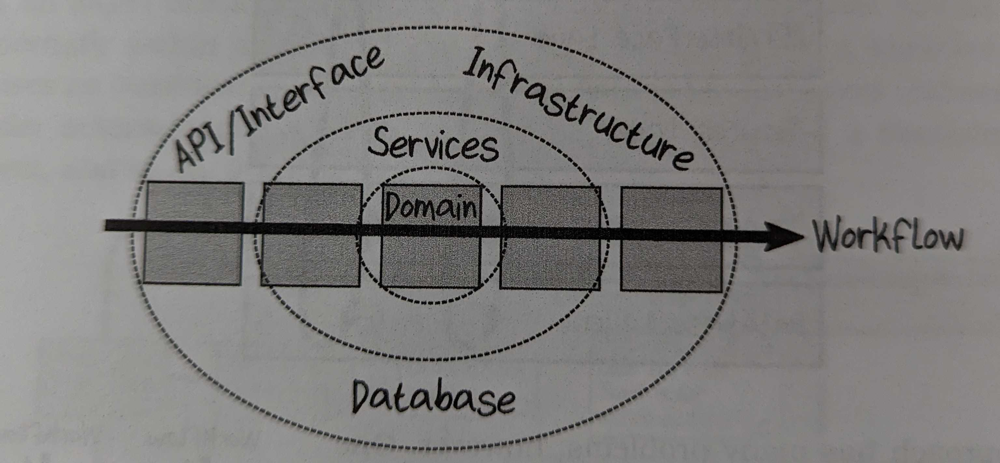

> A use case is a description of the way that an automated system is used. It specifies the input to be provided by the user, the output to be returned to the user, and the processing steps involved in producing that output. A use case describes application-specific business rules
>
> C., Martin Robert. Clean Architecture (Robert C. Martin Series) (p. 192). Pearson Education. Kindle Edition.

> In a functional architecture, the basic unit is also a function, but a much larger business-oriented one that I like to call a workflow. Each workflow represents a unit of functionality—a feature, use case, scenario, story, or whatever you want to call it. Just as functions are “things” at the coding level, these workflows are things at the architectural level, and the basic building blocks of the architecture.
>
> Scott Wlaschin, A primer on functional architecture

Use cases - or workflows if you're using Scott Wlaschin's terminology - are about coordinating domain behaviors that are specific to our application. When we're practicing domain modeling we're going to create objects and functions about the domain and this pure domain code will know nothing about the kind of system it resides in. In order to make use of this pure domain code to do something useful we'll step down one level into our use cases. Use cases know that in order to create a Purchase Order it will have to save the Purchase Order entity into some persistent store. It may not know anything about the details of that store, but somebody somewhere has to call issue a command that says "save this somewhere so we can retrieve it again later".

Use cases are still domain code, in a sense. We will be hiding details about the outside world from them still. They won't know anything at all about HTTP requests or response codes. They won't know anything about SQL (or NoSQL) but they'll be responsible for saving the domain entities. They won't know anything about SES (or other email providers), but they'll be responsible for notifying users when something they care about has happened.

Scott Wlaschin in [article](https://increment.com/software-architecture/primer-on-functional-architecture/) and in his book "Domain Modeling Made functional" uses the word workflow for the same idea. The reason he uses this word is to invoke a functional pipeline. A well designed workflow should read like a well factored functional `pipe()` call.

